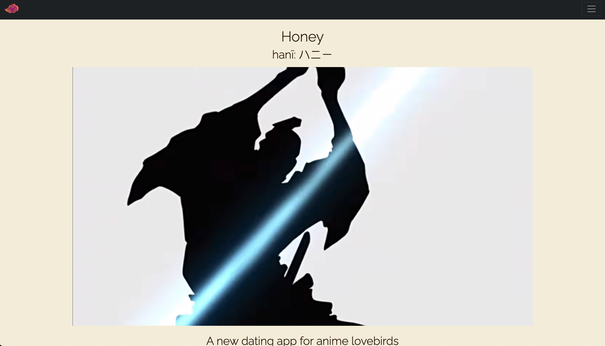
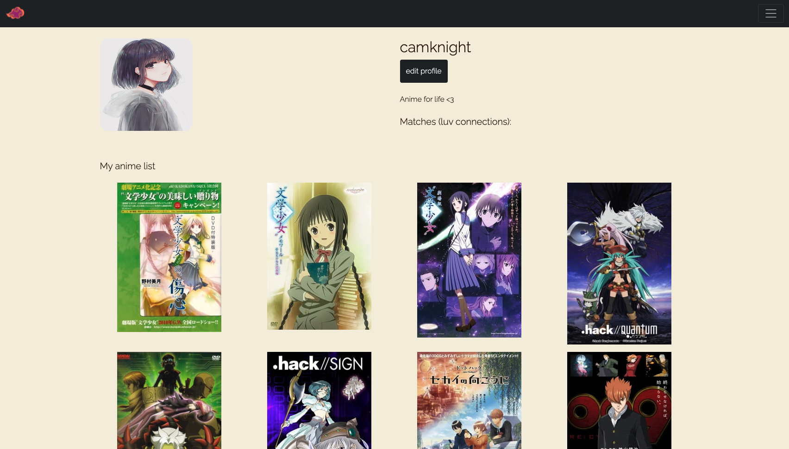
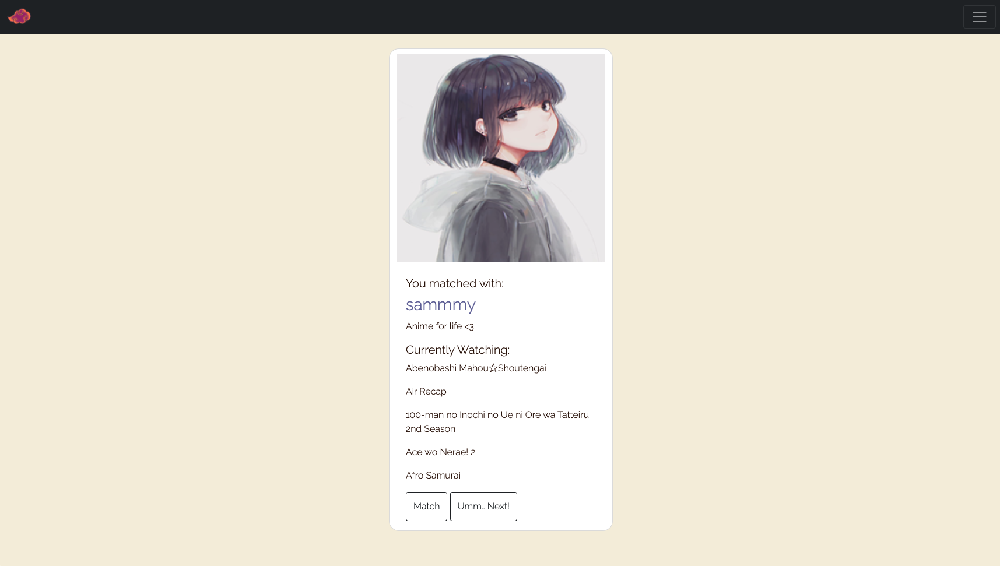
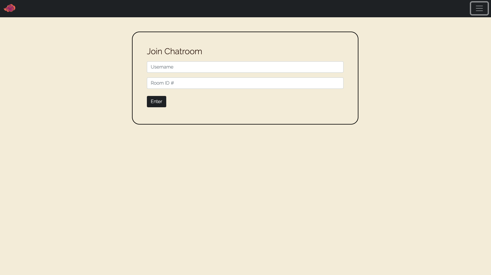
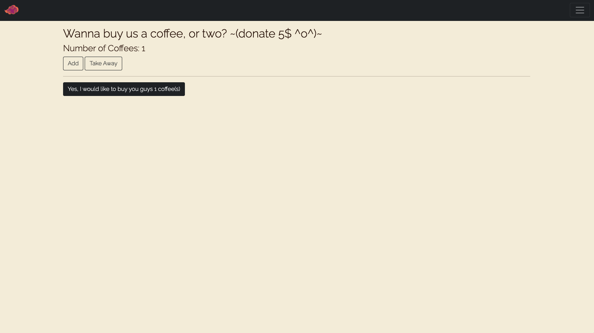
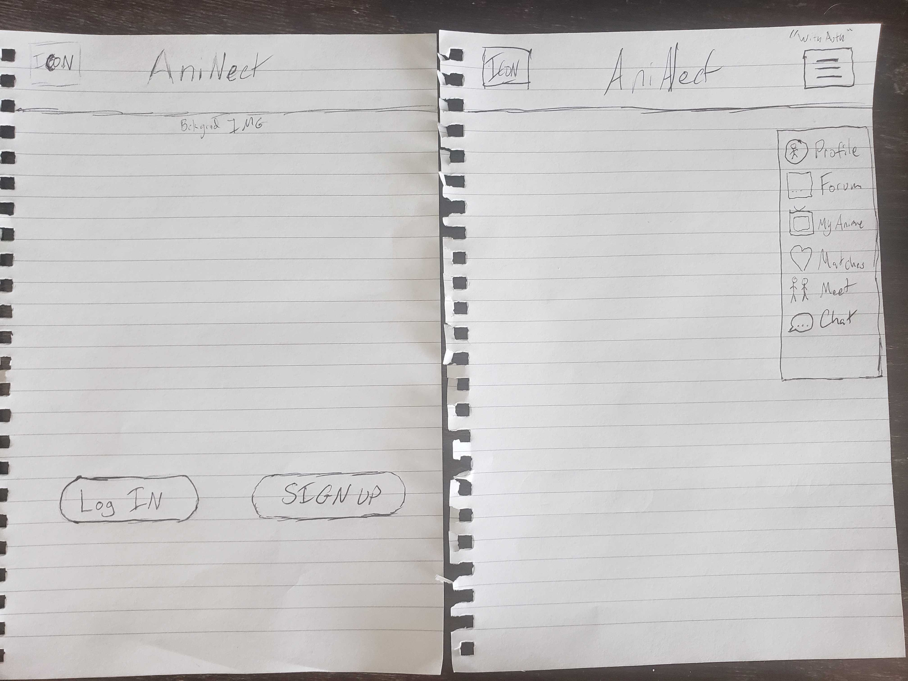
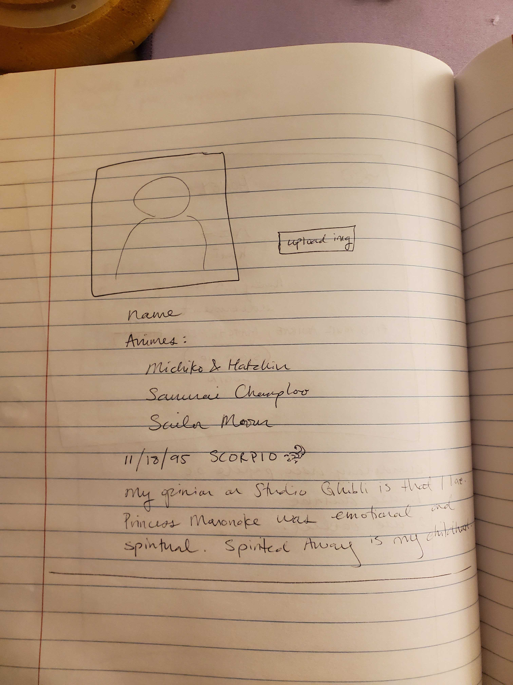
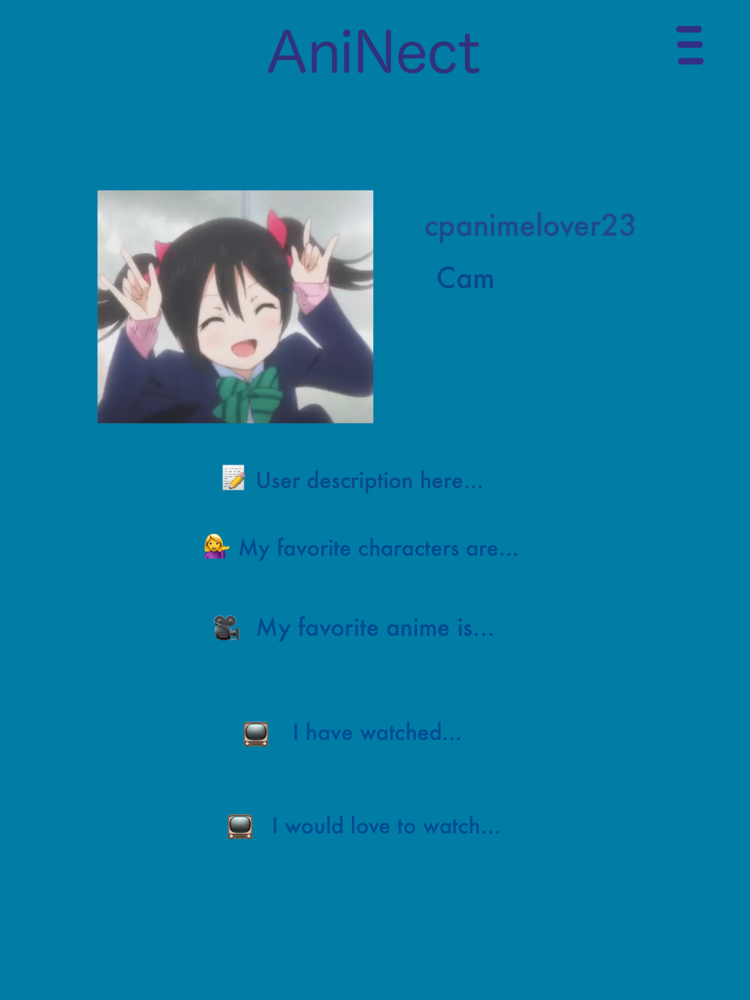
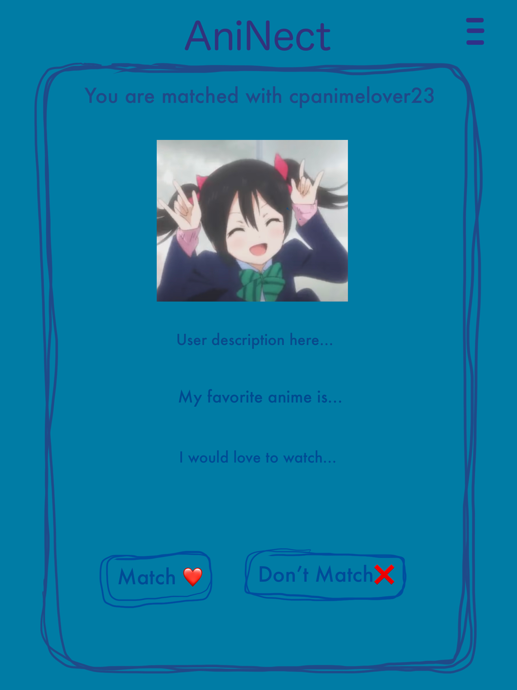

# Honey 🍯🍈

 

## Project Description
This application helps anime lovers find a connection. Anime is a popular topic of discussion, according to Google volume search, close to 100 million people watch anime. Find those that love to watch anime and want to find love at Honey!

 

## Table of Contents
- [Deployment](#installation)
- [Usage](#usage)
- [Credits](#credits)
- [License](#license)
- [Questions](#questions)

 

## Deployment
  

[Repository](https://github.com/middlenamestar/project-3)

 

[Live Deployment](http://hani-honey.herokuapp.com)

 

## Usage

Install all dependencies by typing `npm i` or `npm install` into your terminal from the application. Then type `npm run start` to start the application. If you would like to use the live version, just click the 'Live Deployment' link.

 

### Home

 

### User Profile

 

### Meet

 

### Chat

 

### Donations

 

## Wireframe

 

 

 

 

## Credits

Technologies Used in this project:

Client Side Technologies:

[npm @emotion/react](https://www.npmjs.com/package/@emotion/react)

[npm @emotion/styled](https://www.npmjs.com/package/@emotion/styled)

[npm @testing-library/jest-dom](https://www.npmjs.com/package/@testing-library/jest-dom)

[npm @testing-library/react](https://www.npmjs.com/package/@testing-library/react)

[npm @testing-library/user-event](https://www.npmjs.com/package/@testing-library/user-event)

[npm animate.css](https://www.npmjs.com/package/animate.css?activeTab=versions)

[npm axios](https://www.npmjs.com/package/axios)

[npm bootstrap](https://www.npmjs.com/package/bootstrap)

[npm dotenv](https://www.npmjs.com/package/dotenv)

[npm react](https://www.npmjs.com/package/react)

[npm react-bootstrap](https://www.npmjs.com/package/react-bootstrap)

[npm react-confetti](https://www.npmjs.com/package/react-confetti)

[npm react-cookie](https://www.npmjs.com/package/react-cookie)

[npm react-dom](https://www.npmjs.com/package/react-dom)

[npm react-router-dom](https://www.npmjs.com/package/react-router-dom)

[npm react-scripts](https://www.npmjs.com/package/react-scripts)

[npm react-use](https://www.npmjs.com/package/react-use)

[npm socket.io-client](https://www.npmjs.com/package/socket.io-client)

[npm web-vitals](https://www.npmjs.com/package/web-vitals)

 

Server Side Technologies:

[npm axios](https://www.npmjs.com/package/axios)

[npm bcrypt](https://www.npmjs.com/package/bcrypt)

[npm cors](https://www.npmjs.com/package/cors)

[npm dotenv](https://www.npmjs.com/package/dotenv)

[npm express](https://www.npmjs.com/package/express)

[npm jsonwebtoken](https://www.npmjs.com/package/jsonwebtoken)

[npm moment](https://www.npmjs.com/package/moment)

[npm mongoose](https://www.npmjs.com/package/mongoose)

[npm socket.io](https://www.npmjs.com/package/socket.io)

[npm stripe](https://www.npmjs.com/package/stripe)

[npm uuid](https://www.npmjs.com/package/uuid)

 

All other Technologies:

[npm concurrently](https://www.npmjs.com/package/concurrently)

[MyAnimeList API](https://myanimelist.net)

 

Code Credit:

All starting code was provided by: Trilogy Education Services, LLC, a 2U, Inc. brand.

[Build A Realtime Chat App In ReactJS and NodeJS | Socket.io Tutorial - Pedro Tech](https://youtu.be/NU-HfZY3ATQ)

[Ultimate Tinder Clone | MongoDB | Authentication | Cookies | Chat - Code with Ania Kubów](https://youtu.be/Q70IMS-Qnjk)

[Samurai Champloo – Opening Theme – Battlecry - Funimation](https://youtu.be/Eq6EYcpWB_c)

 

## License 

  
This application uses the MIT License

Copyright 2022 Steven Kravitz, Priscilla Ma, Chris Koilparampil, Jennifer Truong

Permission is hereby granted, free of charge, to any person obtaining a copy of this software and associated documentation files (the "Software"), to deal in the Software without restriction, including without limitation the rights to use, copy, modify, merge, publish, distribute, sublicense, and/or sell copies of the Software, and to permit persons to whom the Software is furnished to do so, subject to the following conditions:

The above copyright notice and this permission notice shall be included in all copies or substantial portions of the Software.

THE SOFTWARE IS PROVIDED "AS IS", WITHOUT WARRANTY OF ANY KIND, EXPRESS OR IMPLIED, INCLUDING BUT NOT LIMITED TO THE WARRANTIES OF MERCHANTABILITY, FITNESS FOR A PARTICULAR PURPOSE AND NONINFRINGEMENT. IN NO EVENT SHALL THE AUTHORS OR COPYRIGHT HOLDERS BE LIABLE FOR ANY CLAIM, DAMAGES OR OTHER LIABILITY, WHETHER IN AN ACTION OF CONTRACT, TORT OR OTHERWISE, ARISING FROM, OUT OF OR IN CONNECTION WITH THE SOFTWARE OR THE USE OR OTHER DEALINGS IN THE SOFTWARE.

For more information, please visit: https://opensource.org/licenses/MIT

 

## Questions
If you have any questions, please reach out to a contributor via GitHub:

[Steven Kravitz](https://github.com/Steven-Kravitz)

[Priscilla Ma](https://github.com/middlenamestar)

[Chris Koilparampil](https://github.com/th3-0G-Kresher)

[Jennifer Truong](https://github.com/jentruong09)